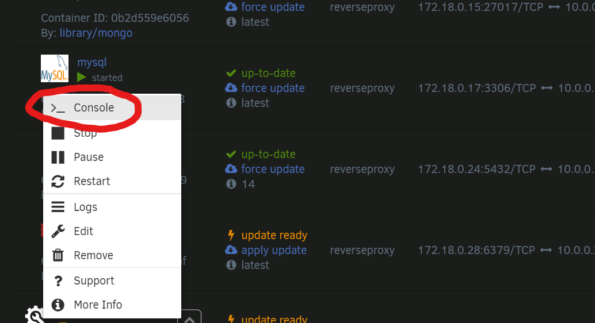
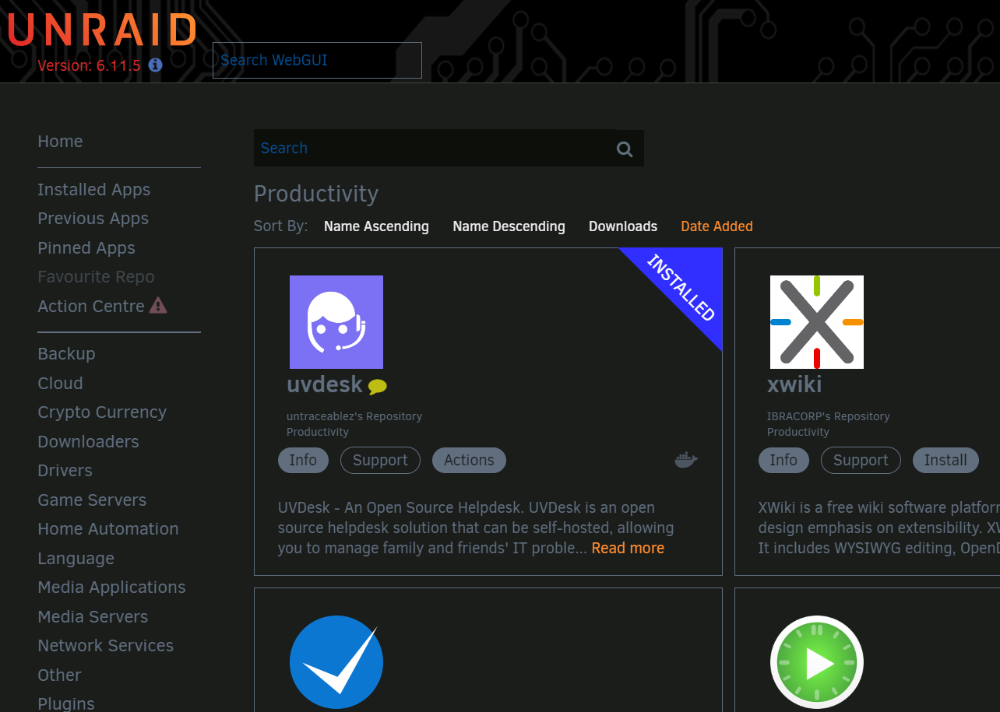

# unraid-apps
A collection of UNRAID app templates I maintain based on upstream Docker images. All credit goes to original authors. 

## [`jenkins-inbound-agent`](https://jenkins.io)

This template is for the [Jenkins Inbound Agent](https://hub.docker.com/r/jenkins/inbound-agent) image. The container serves as a build agent for a pre-existing Jenkins instance. If you don't have one setup, you can try ich777/Jenkins in the unRAID Community Apps as a starting place. 

Prior to installing this application, you'll need to do a few things: 

1. You'll need to create the app directory and the working directory manually in Terminal: 

`mkdir -p /mnt/user/appdata/jenkins-inbound-agent/agent`

2. You'll need to add a new node in your Jenkins instance. 
    a. Navigate to Manage Jenkins > Nodes > "New Node". 
    b. Name your node, pick an all lowercase name, no spaces, e.g. `unraid-jenkins-agent`.
    c. Select `Permanent Agent` as the agent type.

3. Configure the node in Jenkins. After you select `Permanent Agent` and hit next, you should see a configuration page. Change the following items, leave everything else to the defaults:
    a. Number of executors `1` --> `2` or above, depending on how beefy your server is. 
    b. Remote root directory ` ` --> `/home/jenkins/agent`
    You can go ahead and save after this point, any other changes you make I assume you know what you're doing here. 

4. After configuring the node, you'll need to grab the following info to update the unRAID Template:
    a. JENKINS_URL: This should be the URL to access your jenkins instance, e.g. https://jenkins.acme.com/
    b. JENKINS_AGENT_NAME: This will be the name you entered earlier, e.g. `unraid-jenkins-agent`. 
    c. Navigate to Nodes and select your new node by clicking its name. On the Status page you see a bunch of commands, inside of them is your JENKINS_SECRET. You should see it as part of a string like this: `... -url https://jenkins.acme.com/ -secret sdaf65bq3ab563q5v65vb6va5a..` -name. You want to copy the entire string that's between `-secret` and `-name`. 

After doing all of that, you can update the Jenkins Agent Name, Jenkins Instance Secret, and Jenkins URL fields in the template with the info gathered above, and then hit apply. After the container starts up, you can watch the logs and you should see something like this: 

```
Jul 20, 2026 11:15:10 AM hudson.remoting.Launcher createEngine
INFO: Setting up agent: jenkins-agent-02
Jul 20, 2026 11:15:10 AM hudson.remoting.Engine startEngine
INFO: Using Remoting version: 3383.vc8881d4b_0e76
Jul 20, 2026 11:15:10 AM hudson.remoting.Engine startEngine
WARNING: No Working Directory. Using the legacy JAR Cache location: /home/jenkins/.jenkins/cache/jars
Jul 20, 2026 11:15:11 AM hudson.remoting.Launcher$CuiListener status
INFO: WebSocket connection open
Jul 20, 2026 11:15:11 AM hudson.remoting.Launcher$CuiListener status
INFO: Connected
```

You'll also see the status of the node change in Jenkins, and the number of build executors should match the number you selected when configuring the node. 

And that's it, your node is configured and you can now send builds from your pipelines to it! All credit goes to the amazing team over at [Jenkins](https://www.jenkins.io/). 

## uvdesk-unraid

### What is UVDesk?

[**UVDesk**](https://www.uvdesk.com/en/) is a open source helpdesk software solution. It has support for a multitude of features including the following: 

* A multi-customer & multi-agent ticket system.
* A full mailer system to send mail to agents and customers.
* A fully featured knowledge base for self-service.
* CMS Platform Support
* Plugin Support
* Custom branding


#### Requirements

* You will need to have a **local** mySQL or MariaDB instance running on the same docker network as uvdesk. 
    * You will need to create a `uvdesk` database and `uvdesk` user with full privileges on that database *prior* to downloading uvdesk from Community Applications. Please refer to [Setting up the Database](#setting-up-the-database) for instructions.
* You will need a reverse proxy setup. 

#### Reverse-Proxy

Setting up a reverse proxy is a task all unto itself, and best left to better authors than I: 

* IBRACORP NGINX Proxy Manager Guide: <https://youtu.be/h1a4u72o-64>
* IBRACORP NGINX Proxy Manager **with Cloudflare** Guide: <https://www.youtube.com/watch?v=c6Y6M8CdcQ0>
* Spaceinvaderone's Reverse Proxy Guide (SWAG): <https://youtu.be/I0lhZc25Sro>

There are other guides, but these are all unRAID specific and should get you what you need to setup a reverse proxy. Note, the reverse proxy **must be setup prior to installing uvdesk**.


#### Setting up the Database

If you don't know how to setup a database in mySQL, it sounds scarier than it is. First, download a mariaDB or mySQL image from Community Applications. After you've done that, click on the container image and hit console: 



You should be presented with a terminal pop-up browser window. If not, make sure to allow popups from your server's domain name. 

##### Logging In

You'll first need to login to mysql as root, using the password you made when you generated the mySQL template, as so: 

```
mysql -u root -p
Enter password:
```
Once you paste/type in your password, you should see this: 

```
Welcome to the MySQL monitor.  Commands end with ; or \g.
Your MySQL connection id is 9
Server version: 8.0.32 MySQL Community Server - GPL

Copyright (c) 2000, 2023, Oracle and/or its affiliates.

Oracle is a registered trademark of Oracle Corporation and/or its
affiliates. Other names may be trademarks of their respective
owners.

Type 'help;' or '\h' for help. Type '\c' to clear the current input statement.

mysql>
```

##### Creating the User

Now we can create the user (uvdesk by default):   

`CREATE USER 'uvdesk'@'localhost' IDENTIFIED BY 'SUPERSECUREPASSWORDHERE';`

You should see this output:  
`Query OK, 0 rows affected (0.01 sec)`

##### Creating the Database

Now we create the database (uvdesk by default):
`CREATE DATABASE 'uvdesk'`;

Once again, you should see this output:
`Query OK, 1 rows affected (0.01 sec)`

##### Granting User Privileges on Database

Lastly, we need to give our `uvdesk` user all privileges on the uvdesk database: 

`GRANT ALL PRIVILEGES ON uvdesk.* TO 'uvdesk'@'localhost' IDENTIFIED BY 'SUPERSECUREPASSWORDHERE';`

Once last time, you should see this output:  

`Query OK, 1 rows affected (0.01 sec)`

You've now done all the work you'll need to do in mySQL, you can exit the pop-up window or leave by typing `exit`. 

#### Installing uvdesk from Community Applications

To install uvdesk from Community Applications, simply navigate to Community Apps and head to either **Productivity** or **Tools**, or just search `uvdesk`, you should see it in the results like this: 



#### Accessing UVDesk &  First-Time Setup

##### Configuring the Container
When you get to the container configuration page in unRAID, make sure to fill in all of your details regarding your mySQL instance, as well as your intended domain name for your instance (eg. help.mydomain.com). You will also need to generate an app secret, any 32 character randomized string will do. Lastly, make sure to set the timezone and currency to your local ones. 

##### Accessing the webUI
After that, just hit apply and when you navigate to your domain name or http://SERVERIP:6744 you'll be presented with the Setup Wizard. You'll need to type the same mySQL info, and then create an admin user. After that, start exploring! 

